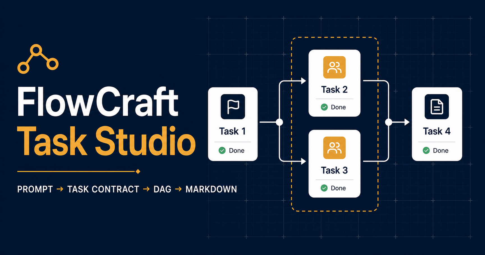
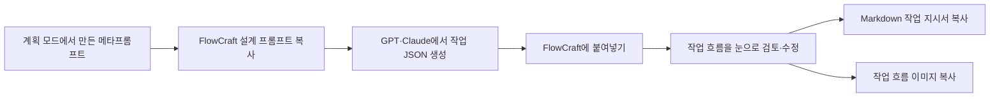

# FlowCraft Task Studio

복잡한 메타프롬프트를 **AI가 실행하기 쉬운 작업 흐름**으로 정리하고,
사용자도 그 계획을 눈으로 확인할 수 있게 만드는 도구입니다.



## 왜 만들었나요?

긴 계획을 글로만 읽으면 어떤 작업이 먼저인지, 무엇을 동시에 진행할 수
있는지, 어느 작업이 병목이 될지 파악하기 어렵습니다.

FlowCraft는 **그래프 엔지니어링의 관점**에서 착안했습니다. 복잡한 계획을
점과 선으로 나누어 바라봅니다.

- 하나의 박스는 해야 할 작업입니다.
- 박스를 잇는 선은 작업 사이의 순서와 의존 관계입니다.
- 같은 그룹으로 묶인 작업은 동시에 진행할 수 있는 작업입니다.
- 각 작업에는 담당, 입력, 결과물과 완료 조건이 들어갑니다.

이렇게 메타프롬프팅을 그래프의 순서와 도식으로 표현하면 두 가지 장점이
생깁니다.

1. **사용자는 계획을 눈으로 확인할 수 있습니다.**
   내가 어떤 순서로 일을 설계했고, 어디에서 작업이 나뉘고 다시 합쳐지는지
   한눈에 볼 수 있습니다.
2. **AI는 더 분명한 작업 지시를 받을 수 있습니다.**
   Codex나 Claude Code가 작업 순서, 병렬 작업, 담당 범위와 완료 조건을
   이해하는 데 도움이 됩니다.

## 어떤 흐름으로 사용하나요?



### 1. 계획을 붙여넣습니다

Codex나 Claude Code의 계획(Plan) 모드에서 만든 메타프롬프트를
`작업 요청`에 붙여넣습니다.

### 2. AI용 설계 프롬프트를 복사합니다

`LLM용 설계 프롬프트 복사`를 누르면 작업량, 순서, 병렬 가능 여부와
서브에이전트 수를 함께 검토하도록 만든 프롬프트가 복사됩니다.

이 프롬프트를 GPT, Claude 또는 원하는 LLM에 전달하면 FlowCraft가 읽을 수
있는 JSON을 받을 수 있습니다.

### 3. JSON으로 작업 흐름을 만듭니다

LLM이 돌려준 JSON을 `LLM 응답`에 붙여넣고 `작업 흐름 만들기`를 누릅니다.
성공하면 입력란은 비워지고 캔버스에 작업 지도가 나타납니다.

### 4. 계획을 눈으로 검토하고 수정합니다

작업 박스를 이동하거나 추가하고, 연결선을 바꾸며 계획을 다듬을 수 있습니다.
오른쪽 작업 편집기에서는 담당, 작업 지시, 입력, 결과물, 완료 조건과 파일
범위를 수정할 수 있습니다.

### 5. AI에게 전달할 작업 지시서를 만듭니다

검토가 끝나면 다음 두 자료를 사용할 수 있습니다.

- **Markdown 작업 지시서:** 바로 복사하거나 `.md` 파일로 내려받습니다.
- **작업 흐름 이미지:** 전체 그래프를 고해상도 PNG로 복사합니다.

Markdown이 실제 실행 기준이고, 이미지는 사람과 AI가 전체 구조를 빠르게
살펴보기 위한 보조 자료입니다.

## 주요 기능

- 작업 순서와 의존 관계를 그래프로 시각화
- 동시에 진행할 수 있는 작업을 병렬 그룹으로 표시
- 작업 추가, 이동, 복제, 삭제와 연결선 편집
- 실행 취소와 다시 실행
- 작업별 담당, 입력, 결과물과 완료 조건 편집
- 순환 연결과 충돌하는 병렬 작업 차단
- 지나치게 많은 서브에이전트 생성을 막는 작업 수 한도
- 이미지 150개처럼 큰 작업을 한 명에게 몰아주는 병목을 검토하는 설계 지침
- 정상 진행 중인 작업은 기다리되 명확한 정체 신호가 있으면 체크포인트와 대체 에이전트로 복구하는 실행 지침
- Markdown 작업 지시서 복사·다운로드
- 전체 작업 흐름 이미지 복사
- 데스크톱과 모바일 화면 지원
- 브라우저 자동 저장

## 서브에이전트를 많이 만들수록 좋은가요?

그렇지 않습니다. 서브에이전트가 많아지면 정보를 공유하고 결과를 합치는
비용도 커집니다.

FlowCraft는 역할마다 에이전트를 하나씩 만드는 대신, **실제로 독립해서
처리할 수 있는 작업인지**를 먼저 살펴보도록 유도합니다.

- `간결 2`: 작은 작업
- `균형 4`: 일반적인 작업에 권장
- `광범위 조사 8`: 서로 독립적인 조사 작업이 많은 경우

숫자는 동시에 실행되는 에이전트 수가 아니라 전체 작업 흐름에서 위임할 수
있는 작업 수의 상한입니다.

## 서브에이전트가 멈춘 것 같으면 어떻게 하나요?

오래 걸린다는 이유만으로 작업을 끊지는 않습니다. 새 메시지, 도구 실행,
파일 변경처럼 진행 신호가 있으면 기존 에이전트를 계속 기다립니다.

다만 같은 오류나 동작이 새 결과 없이 반복되거나, 런타임 실패·세션 소실,
상태 확인 후 무응답처럼 명확한 정체 신호가 확인되면 무한히 기다리지
않습니다.

이 경우 작업 지시서는 지금까지의 유효한 결과를 체크포인트로 회수하고,
완료된 범위는 보존한 채 남은 범위만 새 서브에이전트가 최대 한 번 이어서
처리하도록 안내합니다. 부분 결과만으로 안전하게 진행할 수 있는 후속
작업은 누락 범위와 한계를 밝힌 축소 범위로 계속하고, 불가능한 의존 작업만
중단합니다.

## FlowCraft가 직접 AI를 실행하나요?

아닙니다. FlowCraft는 AI 실행기가 아니라 **계획을 설계하고 검토하는
작업실**입니다.

앱이 OpenAI나 Anthropic API를 직접 호출하지 않습니다. 사용자가 설계
프롬프트를 원하는 LLM에 전달하고, 그 결과를 다시 FlowCraft에 붙여넣는
방식입니다.

## 데이터는 어디에 저장되나요?

입력한 내용과 작업 흐름은 현재 브라우저의 `localStorage`에 저장됩니다.
서버 계정이나 클라우드 동기화 기능은 없습니다.

다만 프롬프트를 GPT나 Claude 같은 외부 서비스에 붙여넣으면 그때부터는
해당 서비스의 데이터 정책이 적용됩니다.

## 직접 실행하기

Node.js 22.13 이상이 필요합니다.

```bash
npm install
npm run dev
```

## 데모

데모 버전은 Netlify에 배포해 두었습니다.

## Codex 스킬

이 저장소에는 FlowCraft 작업 흐름을 Codex에 전달하는
[`flowcraft-codex-handoff`](skills/flowcraft-codex-handoff/SKILL.md) 스킬이
포함되어 있습니다.

계획 모드에서 만든 메타프롬프트를 FlowCraft v2 DAG로 정리하고 다음 세
자료를 한 묶음으로 준비합니다.

- 원래 의도와 제약을 보존한 `original-plan.md`
- 작업 순서와 병렬 구조가 담긴 `workflow-prompt.md`
- 확대해도 선명한 노드·화살표 이미지 `workflow-map.svg`

Markdown 작업 지시서가 실제 실행 기준이며, 원본 계획과 노드 이미지는
의도와 전체 구조를 확인하는 보조 자료입니다.

스킬 폴더를 Codex 개인 스킬 폴더에 복사합니다.

```bash
cp -R skills/flowcraft-codex-handoff ~/.codex/skills/
```

새 Codex 작업에서 다음처럼 호출할 수 있습니다.

```text
$flowcraft-codex-handoff로 이 계획을 Codex 전달용으로 구성해줘.
```

스킬 자체 검사는 실제 전달 파일을 만들지 않는 self-test로 수행할 수
있습니다.

```bash
python3 ~/.codex/skills/flowcraft-codex-handoff/scripts/flowcraft_handoff.py --self-test
```

## 개발자를 위한 정보

- Next.js 16, React 19, Vinext/Vite
- Tailwind CSS 4
- React Flow, Zustand, Zod, Dagre, Lucide

## 기여와 지원

- [기여 방법](.github/CONTRIBUTING.md)
- [행동강령](.github/CODE_OF_CONDUCT.md)
- [보안 취약점 제보](.github/SECURITY.md)
- [지원 안내](.github/SUPPORT.md)
- [MIT 라이선스](LICENSE)

검증 명령:

```bash
npm test
npm run test:e2e
npm run lint
npx tsc --noEmit
npm run test:site
npm audit --omit=dev
```
